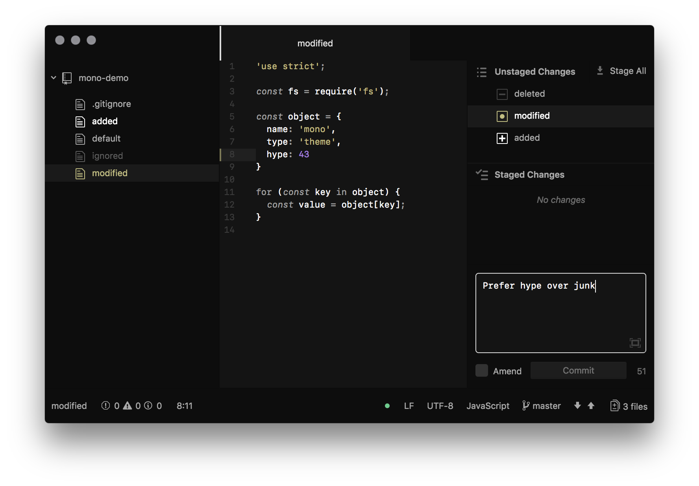
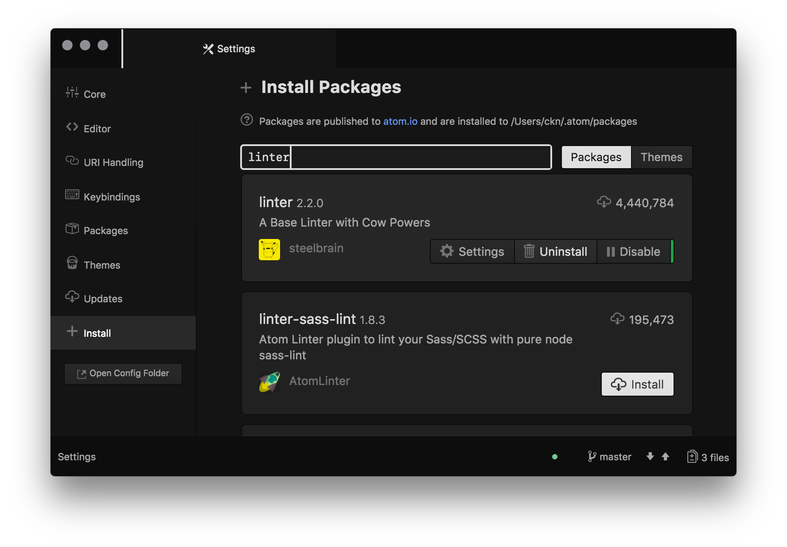
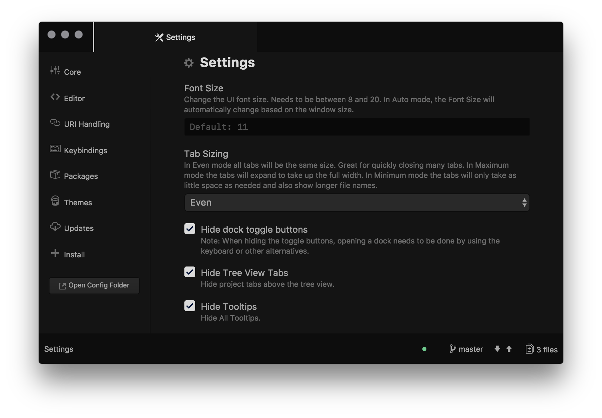

# Mono UI

A mostly monochrome and very dark UI theme for [Atom](https://atom.io).

Essentially a fork of [One Dark UI](https://github.com/atom/one-dark-ui),
_without_ the dynamic colors based on chosen syntax theme.

Screenshots also show the accompanying
[Mono Syntax Theme](https://github.com/atom/one-dark-ui).

